# What is a combination?
- A collection of things where the order does not matter.

## Example
Combinations of [a, b, c]
```
[]
[a]
[b]
[c]
[a, b]
[b, c]
[a, c]
[a, b, c]
```
> Notice how we have [a, b] and we do not have [b, a] because 'order does not matter' [b, a] will be a duplicate and not count as a new combination.

- Given a set of n things, there are 2<sup>n</sup> possible combinations

---

## Below is the descion tree




## Code Example

```js
const combinations = (elements) => {
    // Base case
    if (elements.length == 0){
        return [[]];
    };

    const firstEl = elements[0];
    const rest = elements.slice(1);

    const combWithoutFirstEl = combinations(rest);
    const combWithFirstEl = []


    combWithoutFirstEl.forEach((comb) => {
        const combWithFirst = [...comb, firstEl];
        combWithFirstEl.push(combWithFirst);
    });

    return [...combWithoutFirstEl, ...combWithFirst]
}
```