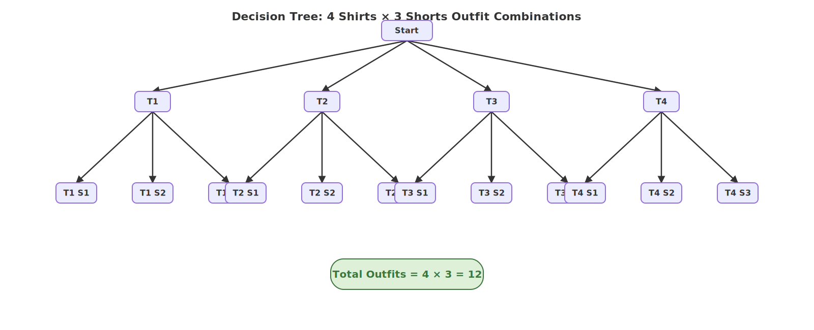
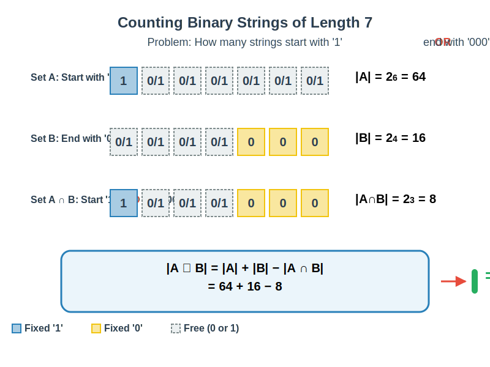
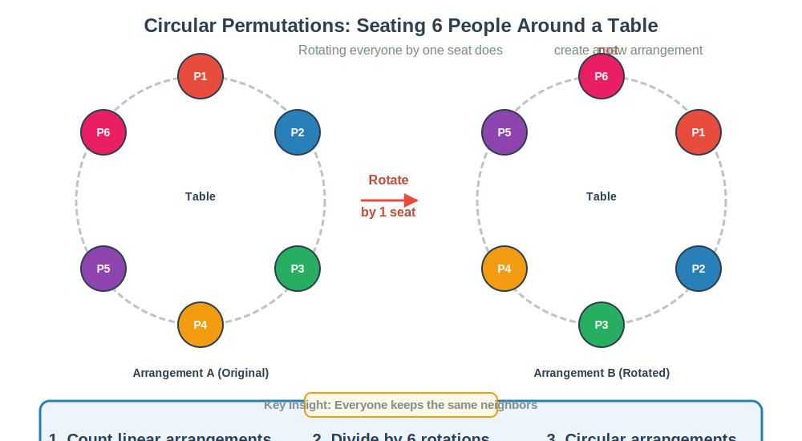

# Counting Rules

## Product Rule
Says that if I have somthing that can be performed in a bunch of different ways then multiple those different ways 

> E.g If I have 4 different shirts and 3 different shorts how many different outfits do I have? 4 x 3 = 12 There answer would be 12 different outfits

## Tree Diagrams
Visual represntation for counting problems

> E.g If I have 4 different shirts and 3 different shorts how many different outfits do I have?

## Sum Rule
If a task can be performed in different n1 ways or one of n2 waus then there are n1 + n2 ways to perform the task

> E.g If I want to go a mall, I can go to the 5 local malls near me or I can travel to the city to one of the 2 malls. How many mall choices do I have? 5 + 2 = 7

## Substraction Rule
If task can be done in either one of n1 ways or one of n2 ways, then the total number of ways to do the task would be n1 + n2 minus the number of ways that are common to the 2 different ways 

> E.g How many bitstrings of length 7 either start with 1 bit or end with the 3 bit 000?

## Division Rule
There are  n &divide; d ways to do a task if it can be done using a precedure that can be carried out in n ways, where there are d corresponding outcomes per group

> E.g How many ways can I sit 6 people around a circular table where 2 seatings are considerd the same when each person has the same left and right neighbor? n! / n

